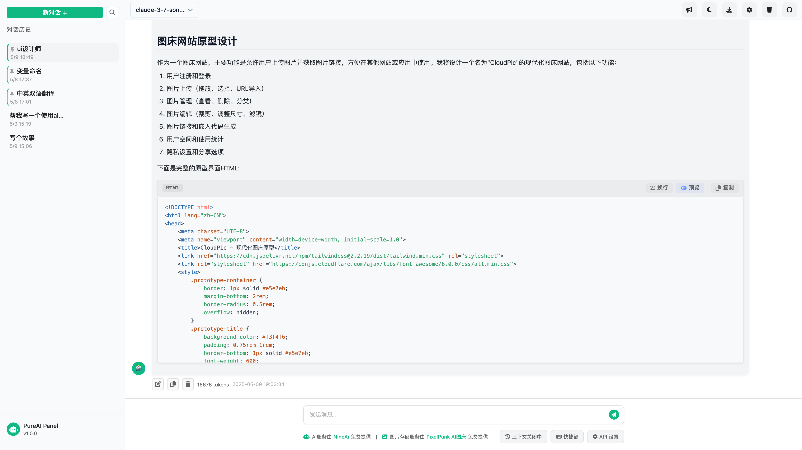

# PureAI Panel

一个简洁、美观、功能强大的 AI 聊天面板，支持多种大型语言模型对话，支持代码高亮和 HTML 预览。

[](https://free.nineai.chat/)
[](LICENSE)
[](https://github.com/yourusername/PureAI-Panel)

## 📝 项目介绍

PureAI Panel 是一个专为 AI 对话设计的前端面板，提供了美观的界面和丰富的功能，让与 AI 的交流更加高效和愉悦。项目使用纯 JavaScript 开发，无需复杂的构建过程，易于部署和定制。



## ✨ 特性

- 💬 支持多种大型语言模型对话
- 🌓 支持亮色/暗色主题切换
- 🔍 上下文对话支持
- 📋 对话历史保存与管理
- 💻 代码块高亮显示
- 🔄 流式响应实时展示
- 🌐 HTML 代码预览功能
- 🎨 Markdown 渲染支持
- 📱 响应式设计，支持移动端
- ⚡ 轻量级，无需复杂构建工具

## 🚀 快速开始

### 安装

```bash
# 克隆仓库
git clone https://github.com/CooperJiang/PureAI-Panel.git

# 进入项目目录
cd PureAI-Panel

# 使用任意 HTTP 服务器运行项目
# 例如使用 Python 的简易 HTTP 服务器
python -m http.server 8000
```

然后在浏览器中访问 `http://localhost:8000` 即可。

### 配置 API

1. 点击页面右上角的 "API 设置" 按钮
2. 输入您的 API 密钥和服务配置信息
3. 保存设置后即可开始使用

## 💡 核心功能

### 代码块展示

PureAI Panel 具有强大的代码块支持功能：

- 支持多种编程语言的语法高亮
- 代码块自动限制高度，滚动查看
- 代码复制按钮
- 代码换行切换功能
- HTML 代码实时预览

### Markdown 渲染

支持丰富的 Markdown 格式：

- 标题、列表、表格等基础元素
- 代码块渲染
- 图片显示
- 链接支持

### 流式响应

- 逐字输出，提供打字机效果
- 光标动画提示
- 支持中断生成
- 代码块生成过程中自动滚动

## 🛠️ 项目结构

```
PureAI-Panel/
├── css/                  # 样式文件
│   ├── base.css          # 基础样式
│   ├── chat-message.css  # 消息样式
│   └── modules/          # 功能模块样式
├── js/                   # JavaScript 文件
│   ├── components/       # 组件
│   ├── ui/               # UI 控制器
│   └── utils.js          # 工具函数
├── index.html            # 主页面
└── README.md             # 项目说明
```

## 🔧 进阶配置

### 自定义主题

PureAI Panel 使用 CSS 变量定义主题颜色，您可以通过修改 `css/base.css` 中的变量来自定义主题：

```css
:root {
    --primary-color: #10b981; /* 主色调 */
    --background-color: #ffffff; /* 背景色 */
    /* 其他变量... */
}

[data-theme="dark"] {
    --primary-color: #81C784; /* 暗色主色调 */
    --background-color: #121212; /* 暗色背景 */
    /* 其他变量... */
}
```

### API 集成

默认支持多种 API 服务，您也可以通过修改 `js/api.js` 文件来集成其他 AI 服务。

## 📋 后续计划

- [ ] 添加更多大语言模型支持
- [ ] 会话导出/导入功能
- [ ] 自定义提示词管理
- [ ] 更多代码语言支持
- [ ] 图像生成功能

## 🤝 贡献指南

欢迎提交 Pull Request 或创建 Issue 来帮助改进项目！

1. Fork 本仓库
2. 创建您的特性分支 (`git checkout -b feature/amazing-feature`)
3. 提交您的改动 (`git commit -m 'Add some amazing feature'`)
4. 推送到分支 (`git push origin feature/amazing-feature`)
5. 创建一个 Pull Request

## 📄 开源协议

本项目基于 MIT 协议开源，查看 [LICENSE](LICENSE) 获取更多信息。

## 🙏 致谢

- [marked](https://github.com/markedjs/marked) - Markdown 解析器
- [highlight.js](https://github.com/highlightjs/highlight.js) - 代码高亮库
- [Font Awesome](https://fontawesome.com/) - 图标库

## 📬 联系方式

如有问题或建议，请通过以下方式联系：

- 提交 [Issue](https://github.com/CooperJiang/PureAI-Panel/issues)
- 邮箱：J_longyan@163.com

---

🚀 [立即体验 PureAI Panel](https://free.nineai.chat/) 